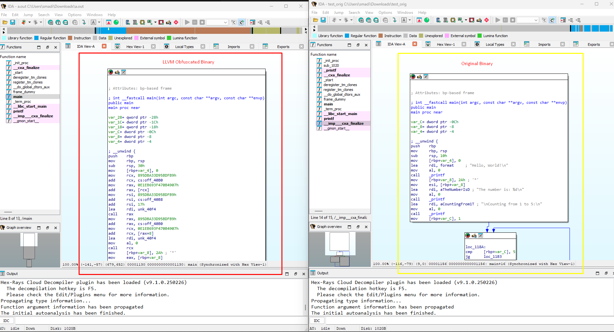

# **Hallucina**

**Hallucina** is a powerful obfuscation tool designed to confuse and hallucinate LLM clients that are used with custom MCP servers for disassemblers such as Ghidra and IDA PRO.

Hallucina makes human-driven reverse engineering mandatory, LLMs will not reverse engineer for us! Sorry Kiddos :)

## **Usage**

Hallucina provides a simple interface for applying obfuscation techniques. Below are some examples of how to use it:

### **Obfuscating a Single File**

To obfuscate a single source file using the generated `clang` (LLVM 17):

```
path_to_build/bin/clang -mllvm -irobf -mllvm --irobf-indbr test.c -o test_obfuscated
```

This command applies the obfuscation techniques specified by the flags `-mllvm -irobf` and `-mllvm --irobf-indbr` to the `test.c` file and generates an obfuscated output file named `test_obfuscated`.

Here you can see the difference between the original and obfuscated test code:



### **Obfuscating a Project**

For larger projects, integrate Hallucina into your build system:

```
CC=path_to_build/bin/clang
CFLAGS+="-mllvm -irobf -mllvm --irobf-indbr"
./configure
make
```

### **Available Obfuscation Flags**

- **Correlation between obfuscation processes.**
- **Indirect jumps**, encrypting the jump targets (`-mllvm -irobf-indbr`).
- **Indirect function calls**, encrypting the target function addresses (`-mllvm -irobf-icall`).
- **Indirect global variable references**, encrypting the variable addresses (`-mllvm -irobf-indgv`).
- **C string encryption** (`-mllvm -irobf-cse`).
- **Procedure-related control flow flattening obfuscation** (`-mllvm -irobf-cff`).
- **Comprehensive application of all the above features** (`-mllvm -irobf-indbr -mllvm -irobf-icall -mllvm -irobf-indgv -mllvm -irobf-cse -mllvm -irobf-cff`).

## **Building Hallucina**

Hallucina supports building with LLVM 17. Follow the instructions below to set up the build environment.

### **Prerequisites**

#### **Windows**

1. Install [Ninja](https://ninja-build.org/) and ensure it is in your PATH.
2. Install Visual Studio 2022 with the C++ development tools.

#### **Linux**

Run the following command to install prerequisites:

```
sudo apt update && sudo apt install -y build-essential cmake ninja-build python3
```

### **Build Instructions**

#### **Windows**

1. Open the x64 Native Tools Command Prompt for VS 2022.
2. Run the following commands:

```
mkdir build
cd build
cmake -DCMAKE_CXX_FLAGS="/utf-8" -DCMAKE_BUILD_TYPE=Release -DLLVM_ENABLE_ASSERTIONS=ON -DLLVM_ENABLE_PROJECTS="clang;clang-tools-extra;lld;lldb" -G "Ninja" ../llvm
ninja
```

#### **Linux**

1. Run the following commands:

```
mkdir build
cd build
cmake -DCMAKE_BUILD_TYPE=Release -DLLVM_ENABLE_ASSERTIONS=ON -DLLVM_ENABLE_PROJECTS="clang;clang-tools-extra;lld;lldb" -G "Ninja" ../llvm
ninja
```

## **Troubleshooting Common Issues**

### **Compilation Errors**

If you encounter errors during compilation, such as missing headers or GCC-specific issues, ensure the following:

- Add `#include <fstream>` to any file reporting missing `std::ifstream`.
- Use the latest version of GCC or Clang for compatibility.

### **Memory Issues During Build**

If you encounter memory issues during the build process, you can increase the swap memory as follows:

#### **Linux**

Run the following commands to temporarily increase swap memory:

```
sudo fallocate -l 4G /swapfile
sudo chmod 600 /swapfile
sudo mkswap /swapfile
sudo swapon /swapfile
```

To make this change permanent, add the following line to `/etc/fstab`:

```
/swapfile none swap sw 0 0
```

## **Important Note**

After building, use the generated `clang` binary located in the `build/bin` directory. This version of `clang` is based on LLVM 17 and includes the obfuscation features provided by Hallucina.

---

## **Contributing to Hallucina**

We welcome contributions! See [`DEVELOPMENT.md`](./DEVELOPMENT.md) for details on setting up your development environment and submitting pull requests.

---

## **License**

This project is licensed under the GNU v3 License. See the [LICENSE](./LICENSE) file for details.

## **References**

- [Goron](https://github.com/amimo/goron)
- [Hikari](https://github.com/HikariObfuscator/Hikari)
- [ollvm](https://github.com/obfuscator-llvm/obfuscator)
- [LLVM](https://llvm.org/)
